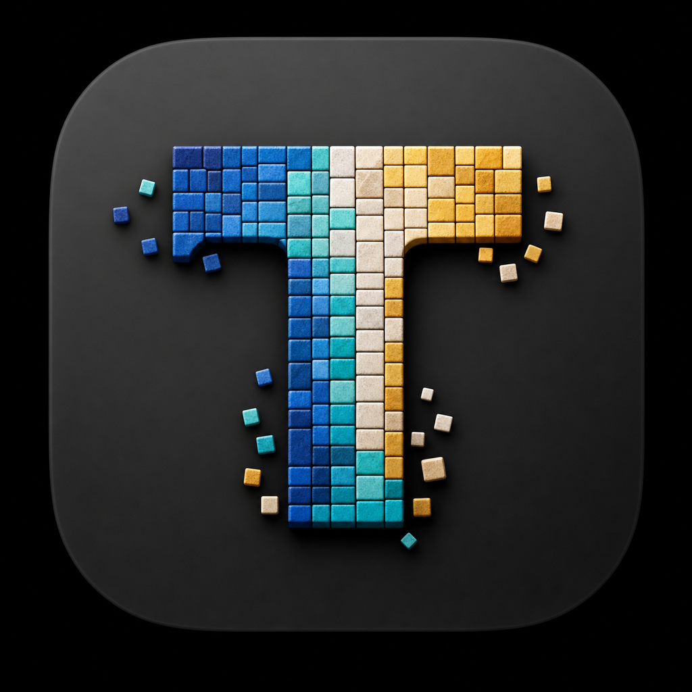

# Tessera

<p align="center">
  
</p>

<p align="center">
  <strong>A powerful, open-source multi-pane web app wrapper.</strong><br>
  Run multiple instances of any web app side-by-side in one window.
</p>

<p align="center">
  <a href="#features">Features</a> •
  <a href="#installation">Installation</a> •
  <a href="#configuration">Configuration</a> •
  <a href="#keyboard-shortcuts">Shortcuts</a> •
  <a href="#building-from-source">Build</a> •
  <a href="#contributing">Contributing</a>
</p>

---

## Why Tessera?

Many web apps (internal tools, AI assistants, dashboards) only allow one instance when "installed as an app" via Chrome. Tessera solves this by giving you a native desktop window with **unlimited split panes**, each running its own independent session of any web app.

Think of it as a tiling window manager — but for web apps, inside a single window.

## Features

| Category | What you get |
|----------|-------------|
| **Multi-Pane Layout** | Split vertically, horizontally, or in a grid. Drag resizers to adjust sizes. No limit on panes. |
| **URL Bar** | Each pane has an editable address bar. Navigate anywhere, or lock panes to a single domain. |
| **Global Hotkey** | Summon/hide the window from any app with a configurable hotkey (default: `⌥ Space`). |
| **SSO / OAuth Support** | Configure which domains stay in-app so authentication flows complete without breaking. |
| **External Link Routing** | Links outside your app open in your default browser. Fully configurable allowlist/blocklist. |
| **Custom CSS & JS Injection** | Inject styles or scripts into every pane (dark mode overrides, auto-dismiss banners, etc.). |
| **Profiles** | Switch between configurations (Work vs Personal). Each profile has its own cookies, URL, and styles. |
| **Themes** | Light, Dark, or System (auto). Configurable accent color. |
| **Privacy Controls** | Custom user agent, proxy support, Do Not Track, clear-on-quit, cache limits. |
| **Notifications** | Desktop notifications, dock badge, sound — all toggleable. |
| **Cross-Platform** | macOS (Apple Silicon + Intel), Linux (AppImage). Windows coming soon. |
| **Fully Customizable** | 50+ settings across 10 categories. Import/export config as JSON. |

## Installation

### macOS

1. Download the appropriate build from [Releases](../../releases):
   - **Apple Silicon** (M1/M2/M3/M4): `Tessera-x.x.x-macOS-AppleSilicon.zip`
   - **Intel**: `Tessera-x.x.x-macOS-Intel.zip`
2. Extract and drag `Tessera.app` to `/Applications`.
3. First launch: right-click → **Open** → click **Open** in the dialog.
4. If macOS says "damaged", run:
   ```bash
   xattr -cr /Applications/Tessera.app
   ```

### Linux

1. Download `Tessera-x.x.x-Linux-x64.AppImage` from [Releases](../../releases).
2. Make it executable:
   ```bash
   chmod +x Tessera-*.AppImage
   ```
3. Run it:
   ```bash
   ./Tessera-*.AppImage
   ```

### Windows

Windows builds require Wine for cross-compilation. To build from source on Windows:

```bash
git clone https://github.com/AshishSardana/tessera.git
cd tessera
npm install
npm run dist:win
```

## Configuration

Open Settings via **⌘ ,** (macOS) or **Ctrl+,** (Linux/Windows), or from the gear icon in the toolbar.

### Quick Start

1. Set your **Default URL** (the web app you want to use).
2. Add any **In-App Domains** needed for SSO (e.g., `*.yourcompany.com`, `login.provider.com`).
3. Optionally set **Auth Path Keywords** if your SSO uses non-standard URL patterns.
4. Choose your preferred **Global Hotkey**.

### Settings Categories

1. **General** — App name, default URL, theme, accent color, launch at login
2. **Navigation** — URL bar visibility, domain locking, homepage button
3. **Authentication** — In-app domains, external domains, auth keywords, cookie partition
4. **External Links** — Default action (browser/new pane/ask), modifier keys, popup handling
5. **Layout & Panes** — Default layout, max panes, header visibility, resizer thickness
6. **Shortcuts** — All keyboard shortcuts are fully customizable (record-style input)
7. **Privacy & Data** — User agent, proxy, DNT, persistent cookies, cache limit
8. **Notifications** — Desktop notifications, dock badge, sound
9. **Advanced** — DevTools, custom CSS/JS injection, preload scripts, hardware acceleration
10. **Profiles** — Multiple named configurations with independent cookies and settings

### Import / Export

Settings can be exported as JSON and imported on another machine — perfect for sharing a team configuration.

## Keyboard Shortcuts

| Action | Default (macOS) | Default (Linux/Win) |
|--------|----------------|---------------------|
| Summon/Hide window | `⌥ Space` | `Alt+Space` |
| New pane | `⌘ T` | `Ctrl+T` |
| Close pane | `⌘ W` | `Ctrl+W` |
| Split vertical | `⌘ \` | `Ctrl+\` |
| Split horizontal | `⌘ ⇧ \` | `Ctrl+Shift+\` |
| Cycle pane (next) | `⌘ ]` | `Ctrl+]` |
| Cycle pane (prev) | `⌘ [` | `Ctrl+[` |
| Reload pane | `⌘ R` | `Ctrl+R` |
| Hard reload | `⌘ ⇧ R` | `Ctrl+Shift+R` |
| Toggle DevTools | `⌥ ⌘ I` | `Alt+Ctrl+I` |
| Open Settings | `⌘ ,` | `Ctrl+,` |

All shortcuts are customizable in Settings → Shortcuts.

## Building from Source

### Prerequisites

- Node.js 18+ (recommended: 22.x)
- npm or pnpm

### Steps

```bash
# Clone the repo
git clone https://github.com/AshishSardana/tessera.git
cd tessera

# Install dependencies
npm install

# Run in development mode
npm start

# Build for your platform
npm run dist:mac    # macOS (arm64 + x64)
npm run dist:win    # Windows (requires Wine on non-Windows)
npm run dist:linux  # Linux (AppImage)
npm run dist        # All platforms
```

Build output goes to `dist/`.

## Architecture

```
tessera/
├── assets/              # App icon and images
├── src/
│   ├── main/            # Electron main process
│   │   ├── main.js      # App lifecycle, window management, IPC, link routing
│   │   ├── store.js     # Settings persistence (electron-store)
│   │   ├── preload.js   # Preload bridge for main window
│   │   └── preload-settings.js  # Preload bridge for settings window
│   ├── renderer/        # Main window UI
│   │   ├── index.html   # App shell
│   │   ├── styles.css   # Theme-aware styles
│   │   └── renderer.js  # Split-pane layout engine, pane management
│   └── settings/        # Settings window UI
│       ├── settings.html
│       ├── settings.css
│       └── settings.js  # Data binding, shortcut recording, profiles
├── package.json         # Dependencies and build config
├── LICENSE              # MIT License
└── README.md
```

## Contributing

Contributions are welcome! Please see [CONTRIBUTING.md](CONTRIBUTING.md) for guidelines.

### Ideas for contribution

- Windows build CI/CD pipeline
- Tab mode (in addition to split panes)
- Session restore on restart
- Drag-and-drop pane reordering
- Plugin system for custom pane types
- Auto-update mechanism

## License

MIT — see [LICENSE](LICENSE) for details.

---

<p align="center">
  <sub>Built with Electron. Designed for productivity.</sub>
</p>
